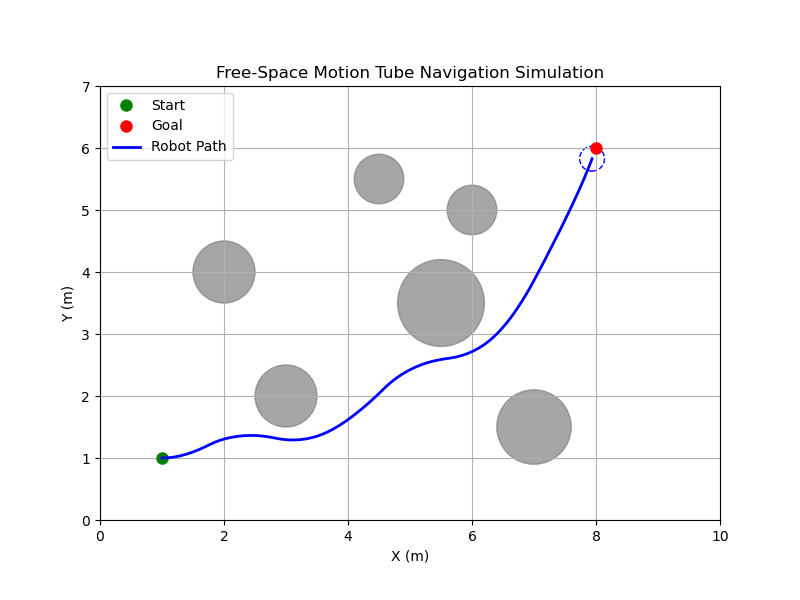

# Free-Space Motion Tube Simulation

This project implements the core motion planning algorithm described in *"Clutter-resilient autonomous mobile robot navigation with computationally efficient free-space features"* (ISRR 2022) as a 2D simulation in Python. The algorithm enables real-time planning for non-holonomic robots using boundary-based collision checking over short-horizon motion primitives.

## Overview

The robot is modeled with fixed-speed motion primitives sampled over a range of angular velocities. For each primitive, the planner:
- Generates a “tube” by offsetting the robot's trajectory by its radius,
- Checks the full boundary for collisions with circular obstacles,
- Selects the motion whose endpoint is closest to the goal, among all feasible options.

## Demo



> 🟢 Start | 🔴 Goal | ⚫ Obstacles | 🔵 Path

## Dependencies

- Python 3
- NumPy
- Matplotlib

To run:

```bash
python motion_tube_simulation.py
```

## Works Cited
Teixeira Rodrigues, R., Tsiogkas, N., Huebel, N., Bruyninckx, H., Asfour, T., Billard, A., & Khatib, O. (2022). Clutter-resilient autonomous mobile robot navigation with computationally efficient free-space features. In The International Symposium on Robotics Research (Vol. 27, pp. 522–537). Springer, Cham. https://doi.org/10.1007/978-3-031-25555-7_35